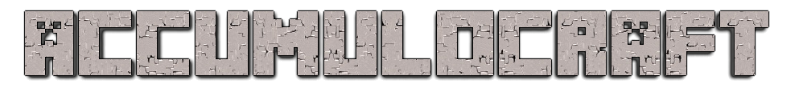

## Why

We want to be cool like all the other kids.

## Server

Get a MC server. I looked [here](http://wiki.vg/Server_List) and chose [Dragonet](http://dragonet.org/)
because it supported [Bukkit](http://bukkit.org/) Java plugins and Minecraft PE. A close
second was [GlowstonePlusPlus](https://github.com/GlowstonePlusPlus/GlowstonePlusPlus) which
Dragonet might be a fork of?

Maybe the vanilla server will work? [See bottom of this page](https://minecraft.net/download)
[or here](https://s3.amazonaws.com/Minecraft.Download/versions/1.8.8/minecraft_server.1.8.8.jar)

```
java -Xmx1024M -Xms1024M -jar minecraft_server.1.8.8.jar nogui
```

## Client

The official [Minecraft client](https://minecraft.net/download) will work. You'll need
to login/register and change to a paid account. Or download a [hack](http://wiki.vg/Client_List)
Never tried that though.

## Resources
Looks like this might be useful at some point.
https://www.spigotmc.org/resources/essentials.24/
